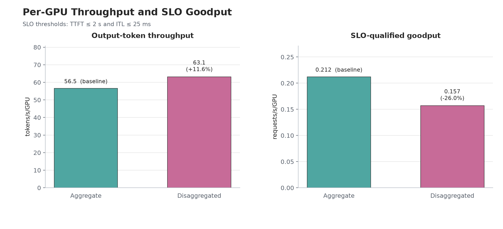
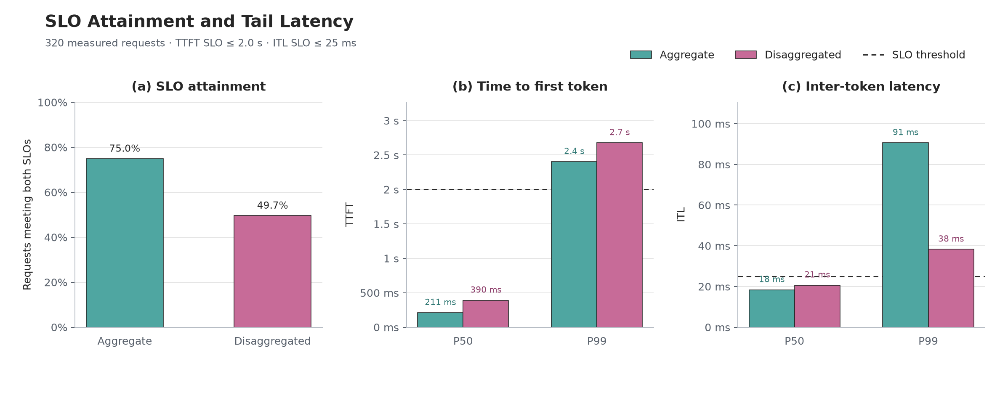

# Qwen3-235B-A22B-FP8 serving experiments

We've conducted two experiments to compare aggregate serving and prefill/decode disaggregation
for `Qwen/Qwen3-235B-A22B-FP8` on 16 x H100 GPUs. Specific configurations can be found in both the Appendix section and `yaml` files.

| Recipe | Worker layout | Router |
|---|---|---|
| [`agg-round-robin`](./vllm/agg-round-robin/) | 4 aggregate workers, TP4 | round-robin |
| [`disagg`](./vllm/disagg/) | 2 prefill + 2 decode workers, TP4 | round-robin |

## Results

Please read the Limitations section for the caveat of the experiment!

| Metric | Aggregate, 4 x TP4 | Disaggregated, 2P/2D x TP4 |
|---|---:|---:|
| Request throughput | 4.523 req/s | **5.050 req/s** |
| Total token throughput | 18,997.76 tok/s | **21,250.56 tok/s** |
| Output token throughput | 904.65 tok/s | **1,010.01 tok/s** |
| Mean TTFT | **440.88 ms** | 500.69 ms |
| TTFT p50 | **210.56 ms** | 390.31 ms |
| TTFT p99 | **2,403.02 ms** | 2,676.85 ms |
| Mean ITL | 31.76 ms | **27.94 ms** |
| ITL p50 | **18.39 ms** | 20.65 ms |
| ITL p99 | 90.59 ms | **38.27 ms** |
| Mean request latency | 6.76 s | **6.06 s** |
| SLO-qualified request fraction | **75.0%** | 49.7% |
| SLO-qualified goodput | **3.392 req/s** | 2.509 req/s |
| Errors | 0 | 0 |

  
   
  Figure 1. Per-GPU output-token throughput and exact TTFT/ITL SLO-qualified goodput.

  
   
  Figure 2. SLO-qualified request fraction and P50/P99 TTFT and ITL.

### Limitations

Although the disaggregated setup delivered **11.6% more raw output-token
throughput**, you may wonder why only **49.7%** of its requests satisfied both the TTFT(<2s) and ITL(<25ms) SLOs, compared with **75.0%** for the aggregate setup.

We have later identified that there was one GPU (out of 16 GPUs) with higher temperature, lower power draw, and reduced performance compared to other GPUs. This is likely due to thermal throttling problem, while this benchmark result can't establish the root cause.

While it's only one out of 16, this contaminates the result, because every worker uses TP4, a slowdown on one GPU could stall the other three GPUs participating in the same worker (since TP needs communication in intermediate states). This is 1/4 of Aggregated setup and 1/2 of decode worker in disaggregated setup!

As evidence, one aggregate worker and one disaggregated decode worker had
substantially higher inter-token latency than their peers:

| Setup | Slow worker ITL | Peer worker ITL |
|---|---:|---:|
| Aggregate | **101.70 ms mean, 39.85 ms p50** | 22.16–23.53 ms mean, 14.21–14.29 ms p50 |
| Disaggregated decode | **35.19 ms mean, 37.29 ms p50** | 19.80 ms mean, 20.54 ms p50 |

In order to measure the actual performance difference, we would need to re-run and compare with balanced hardware.

## How to run the experiments

Each topology has a standalone runbook that creates its manifests under the
recipe-specific `/ephemeral/shared/...` directory:

- [Aggregate round-robin](./vllm/agg-round-robin/README.md)
- [Prefill/decode disaggregation](./vllm/disagg/README.md)

# Appendix

## Comparability

Shared configurations are:

- 2 nodes with 8 H100 GPUs each, 16 GPUs total
- `Qwen/Qwen3-235B-A22B-FP8`
- Dynamo v1.3.0 vLLM runtime
- TP4, DP1, and expert parallelism per worker
- 8,192-token maximum context length
- GPU memory utilization 0.90
- chunked prefill, 128 maximum sequences, and 8,192 batched tokens
- prefix caching with 128-token blocks

### Workload

- synthetic, non-shared prompts with a fixed 4,000 ISL, 200 OSL (`ignore_eos: true`)
  - synthetic prompt pool: 12,800 entries, generated with random seed 100
- temperature 0 and repetition penalty 1.0
- concurrency=32
- 32 warmup requests and 320 measured requests

### Experiment 1. Aggregate round-robin baseline

- Runs 4 aggregate TP4 workers every worker performs both prefill and decode.
- Uses round-robin frontend routing.
- Serves as the throughput and latency baseline.

### Experiment 2. Prefill/decode disaggregation

- Uses 2 prefill TP4 workers and 2 decode TP4 workers.
- Reused disaggregated configs from qwen32-bench:
  - `qwen32-bench/qwen-roce`
  - two `rdma/ib` resources per worker
  - UCX device `mlx5_8:1`
